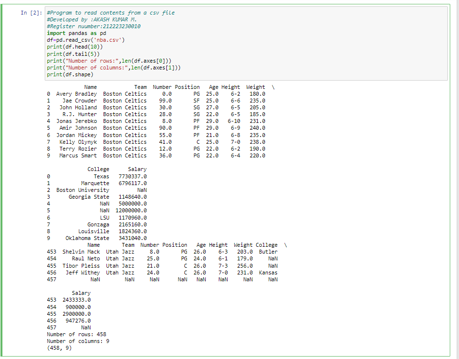

# Read-from-CSV

## AIM:

## ALGORITHM:
### Step 1:
Import the pandas library as "pd".
### Step 2:
Read the CSV file "cars.csv" using read_csv() method and assign it to the variable "df".
### Step 3:
Use head and tail method to get the required contents from the file.
### Step 4:
Use len() method to get the number of rows and columns and 'shape' attribute to find the
dimensions of the dataframe.
### Step 5:
Print the output and end the program.

## PROGRAM:
```
#Program to read contents from a csv file
#Developed by :AKASH KUMAR M.
#Register nuumber:212223230010
import pandas as pd
df=pd.read_csv('nba.csv')
print(df.head(10))
print(df.tail(5))
print("Number of rows:",len(df.axes[0]))
print("Number of columns:",len(df.axes[1]))
print(df.shape)
```

## OUTPUT:


## RESULT:
Thus a python program is written to read the contents of a CSV file.

